# Practica servidor web
## 1. Titulo
Contenedores 
## 2. Tiempo de duración
8 horas 
## 3. Fundamentos:
     Docker:Docker es una herramienta que permite crear, ejecutar y gestionar contenedores. Estos contenedores funcionan como pequeñas máquinas virtuales, pero son más rápidos y ligeros. Se usan para ejecutar aplicaciones de forma aislada, ordenada y portable.

     Contenedor: Un contenedor es como una cajita virtual que guarda todo lo necesario para que una aplicación funcione: código, dependencias, configuraciones, etc. Piensa en él como una app empaquetada lista para usarse, sin importar el sistema operativo en el que estés.

   Nginx: es un servidor web ligero y rápido. Se usa para mostrar páginas web, redirigir tráfico, o incluso como servidor proxy. En Docker, puedes usar una imagen oficial de Nginx para montar sitios web fácilmente.

     Estructura docker:
        - La estructura típica de Docker incluye:

        - Dockerfile: Instrucciones para crear una imagen.

        - Imagen: Un modelo (plantilla) que contiene todo lo necesario para crear un contenedor.

        - Contenedor: La instancia en ejecución de una imagen.

        - Volúmenes: Espacio para guardar datos fuera del contenedor.

        - Puertos: Comunicación entre el contenedor y el mundo exterior.
     
     Contenedor desenlazado:Es un contenedor que se ejecuta en segundo plano, sin mostrar su salida directamente en la terminal. Se lanza usando el parámetro -d en el comando docker run.

## 4. Conocimientos previos.
   
Para realizar esta practica el estudiante necesita tener claro los siguientes temas:
- Comandos linux.
- Plataforma de Docker playground entorno en el que se va a trabajar 
- Terminal o consola para lineas de comandos

## 5. Objetivos a alcanzar
   
- Entender una imagen
- Entender la diferencia entre maquina virtual y contenedor.
- Conocer el entorno Docker playground
- Crear servidores con nginx 
- Intercambiar informacion entre los servidores
## 6. Equipo necesario:
  
- Computador con sistema operativo Windows/Linux
- Plataforma Docker playground

## 7. Material de apoyo.
   
- Documentacion de tendencias tecnologicas.
- Docker playground
- Video ilustrativo
- Documentacion sobre comandos basicos de vi, cat, docker.
  
## 8. Procedimiento

Paso 1:Suscribirse en docker  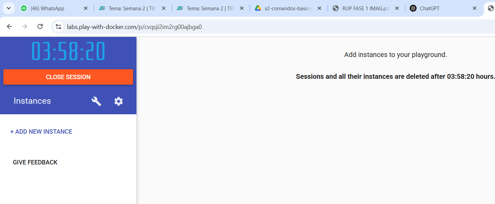

Paso 2: Crear nueva instancia

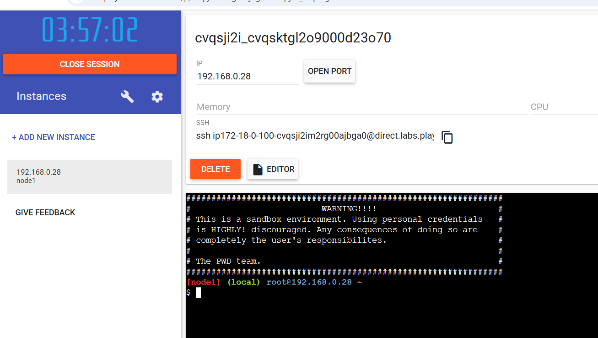

paso 3: Verificar la version

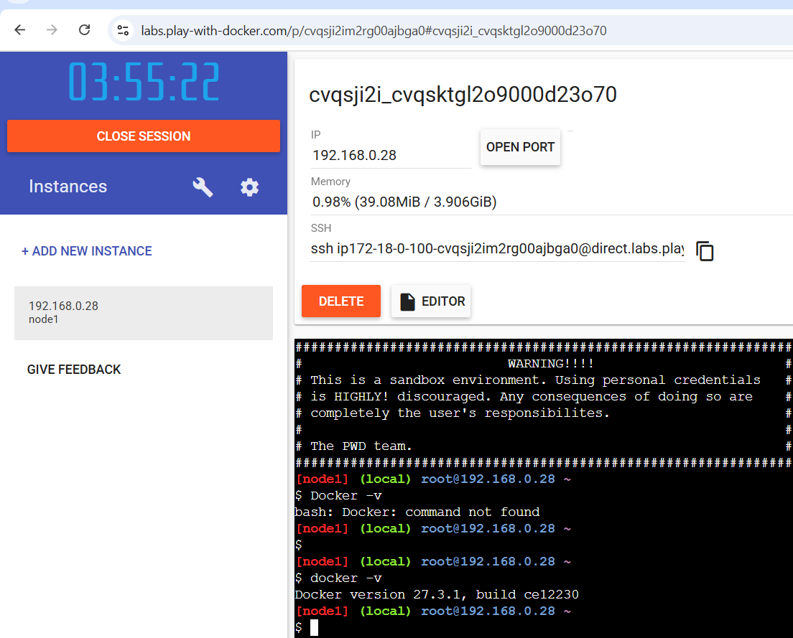

paso 4: intallar la imagen hola mundo, para probar (nombre, contenido, ruta)
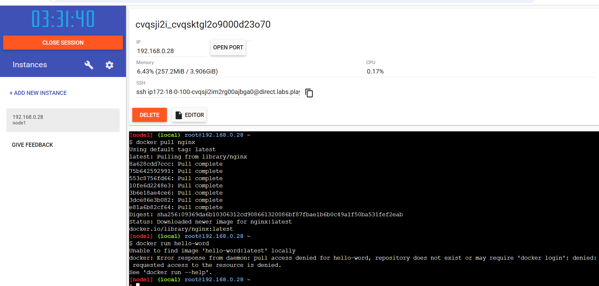

paso 5: intallar el contenedor usando docker container run hello world
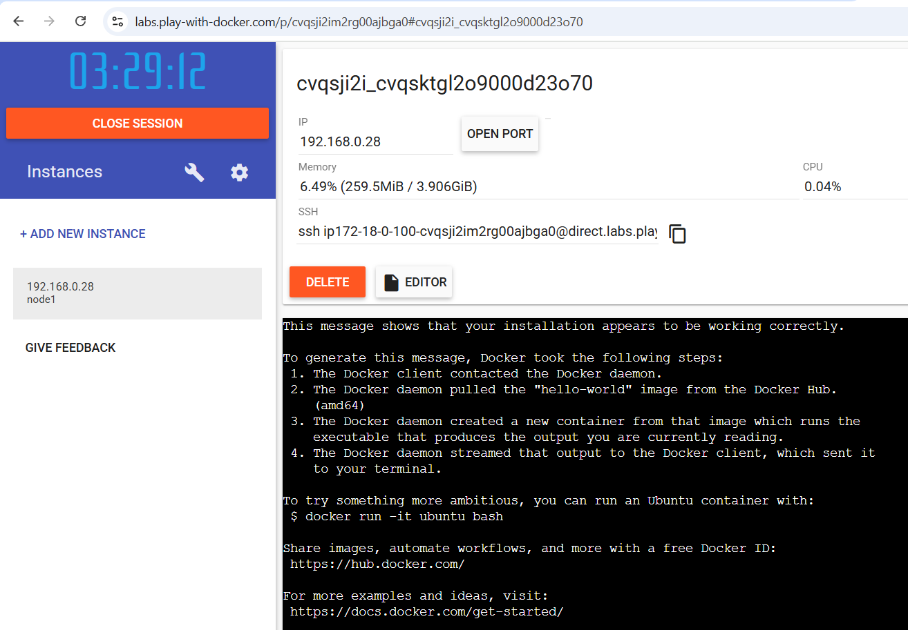

paso 6: Verificacion del contendor creado
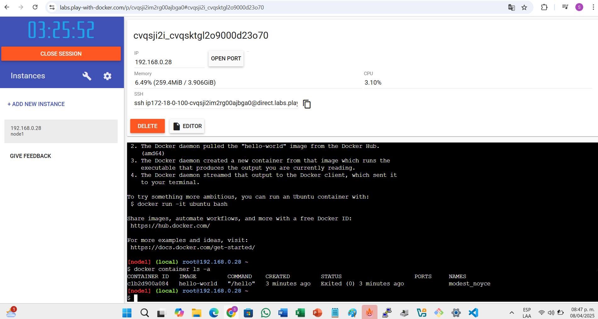

paso 7: Verificacion de los 2 contenedores creados
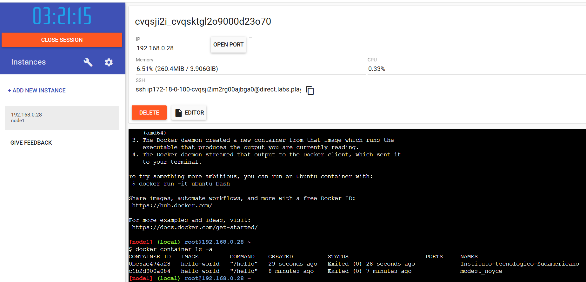

paso 8: Intalla la imagen nginx
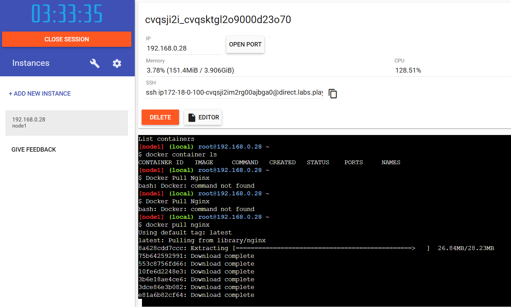

paso 9: modificar el index.html 
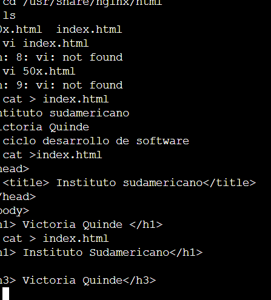

paso 10: Copiar informacion de index 1 a index 2
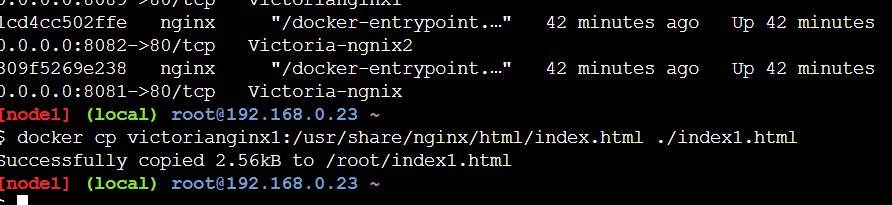

paso 11: Copiar informacion de index 2 a index 1

paso 12: verificacion de la informacion
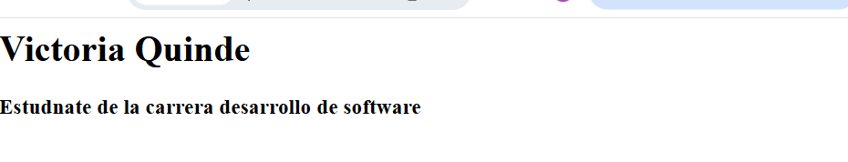

paso 13: revision de los puertos 
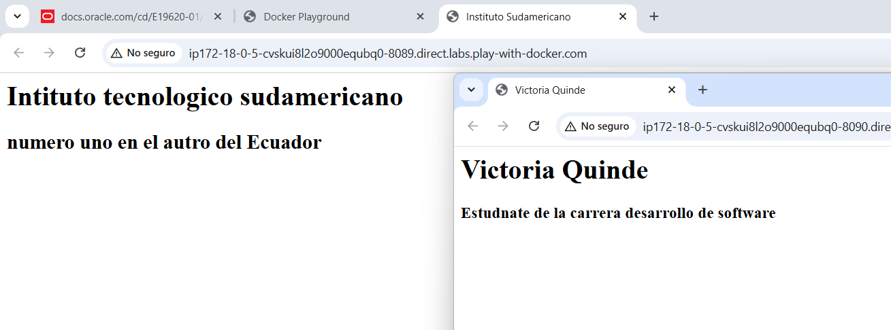

## 9. Resultados esperados:
    
Al finalizar esta practica se pudo evidenciar la importancia de la practica anterior sobre el uso de comandos basicos, enterder como usar un contenedor y servidor.

## 10. Bibliografía
    
- Shotts, W. E. (2019). The Linux command line: A complete introduction (2nd ed.). No Starch Press.

- Chacon, S., & Straub, B. (2014). Pro Git (2nd ed.). Apress. https://git-scm.com/book/en/v2

- Ghazal, B. (2020). Linux basics for hackers: Getting started with networking, scripting, and security in Kali. No Starch Press.

audio:

<audio controls>
  <source src="media/nota.ogg" type="audio/ogg">
 
</audio>
